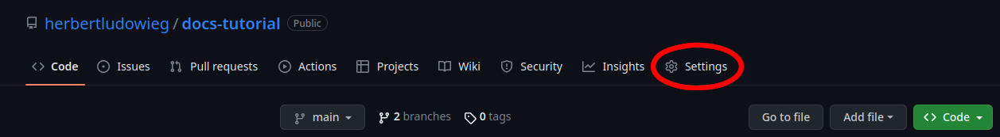

# Tutorial on creating documentation to publish on GitHub Pages

**Disclaimer**: this is based purely on the knowledge that I have gathered through the years. I am in no way an expert on how to do this. A lot of what you'll see here are things that I have personally done and should serve as a beginner guide.

GitHub has a service for open source projects where you can host
documentation pages for your code base called GitHub pages. Enabling this
service allows the maintainers to automatically build the documentation pages in HTML or Markdown format. This is a step-by-step tutorial that will walk you through how to do this for three cases:

- Pure HTML
- Pure Markdown
- reStructured text converted into HTML

In the first case for pure HTML code it is very simple as there is not conversion that has to happen to publish to an HTML website (I use this on my personal portfolio website). This can give you the most control over how your website/documentation looks, but requires the greatest amount of work, obviously. Using pure Markdown is a very convenient option as it is simple to create pages, very simplistic, and easy to maintain. However, this can be very restrictive in terms of how the final product will look. Using reStructured text is similar to how you would write things in Markdown, but it is very simple to use third-party programs like [Sphinx](https://www.sphinx-doc.org/en/master/) to compile the files into HTML. Some third party programs, like Sphinx, can also go through your source code and, as long as the formatting is correct, they can automatically build the documentation for the source code (I use this a Python code that I have created).

## Enabling GitHub pages on the repository

First thing you want to do is go to the "Settings" tab in the repository

Then you want to go into the "Pages" tab

![image}(images/settings-sel-page.png)

