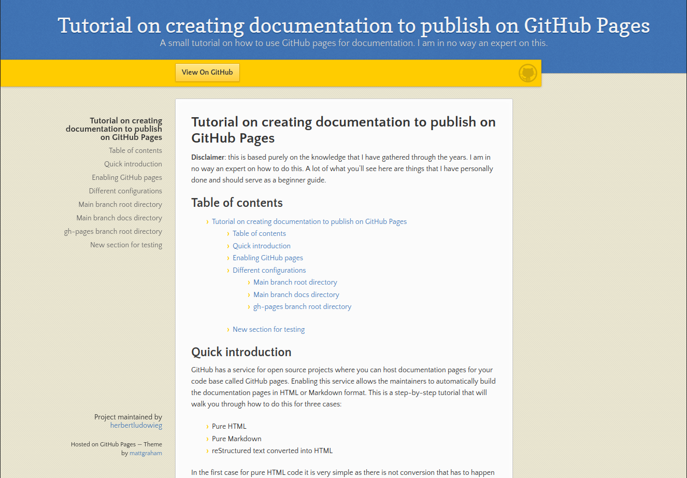

# Tutorial on creating documentation to publish on GitHub Pages

##### Disclaimer

This is based purely on the knowledge that I have gathered through the years. I am in no way an expert on how to do this. A lot of what you'll see here are things that I have personally done and should serve as a beginner guide.

## Table of contents

* TOC
  {:toc}

## Quick introduction

GitHub has a service for open source projects where you can host
documentation pages for your code base called GitHub pages. Enabling this
service allows the maintainers to automatically build the documentation pages in HTML or Markdown format. This is a step-by-step tutorial that will walk you through how to do this for three cases:

- Pure HTML
- Pure Markdown
- reStructured text converted into HTML

In the first case for pure HTML code it is very simple as there is not conversion that has to happen to publish to an HTML website (I use this on my personal portfolio website). This can give you the most control over how your website/documentation looks, but requires the greatest amount of work, obviously. Using pure Markdown is a very convenient option as it is simple to create pages, very simplistic, and easy to maintain. However, this can be very restrictive in terms of how the final product will look. Using reStructured text is similar to how you would write things in Markdown, but it is very simple to use third-party programs like [Sphinx](https://www.sphinx-doc.org/en/master/) to compile the files into HTML. Some third party programs, like Sphinx, can also go through your source code and, as long as the formatting is correct, they can automatically build the documentation for the source code (I use this a Python code that I have created).

##### Note:

I am assuming that you are creating the documentation pages for a repository, not a personal website to be hosted with the web address `https://username.github.io`. If you are trying to create a personal website, you will need to create a repository with the name `username.github.io`, where `username` in both cases is your GitHub username. I will highlight where there may be some slight differences in the information provided here, but the only difference is the web address used for the website.

## Enabling GitHub pages

First thing you want to do is go to the "Settings" tab in the repository


Then you want to go into the "Pages" tab


If you have not set up the GitHub pages you will see


For this tutorial I will only be talking about how to do this when source is left as the default "Deploy from a branch". There is a drop down menu to select which branch you want to deploy from


Once you select it, there will be an additional drop down to select which directory to build the deployed pages from as


In this tutorial we will go through the following combinations:

- Build from `main` branch from `/(root)` directory

- Build from `main` branch from `/docs` directory

- Build from `gh-pages` branch from `/(root)` directory. I just arbitrarily use the `gh-pages` branch as I usually reserve it for when I build the documentation with Sphinx and do a force push to this branch (more on this later).

Once you select the branch and directory (for now just do it as `main` branch and `/(root)` directory) you want to go ahead and hit "Save". This will trigger a workflow build "pages-build-deployment" in the "Actions" tab


You will now see


Once the orange dot turns into a solid green check as


The page should have been deployed with the contents of the `README.md` file being displayed on the website that was created. Typically the web address will be `https://username.github.io/repo-name`, where `username` is your GitHub username and `repo-name` is the name of the repository. Here, there can be a small difference in what you may be doing. If this is your personal website such that `repo-name` is `username.github.io`, the web address is just `https://username.github.io`. You can find where the pages are hosted in the GitHub pages settings seen here


When you go to the website, what you will find is that there is a link to the same page on the top of the webpage. To get rid of this create a new directory `_layouts` and in that directory copy paste the following contents into a file called `default.html`

```html
<!DOCTYPE html>
<html lang="{{ page.lang | default: site.lang | default: "en-US" }}">
  <head>
    <meta charset="UTF-8">
    <meta http-equiv="X-UA-Compatible" content="IE=edge">
    <meta name="viewport" content="width=device-width, initial-scale=1">


    <link rel="stylesheet" href="{{ "/assets/css/style.css?v=" | append: site.github.build_revision | relative_url }}">
    
  </head>
  <body>
    <div class="container-lg px-3 my-5 markdown-body">

      {{ content }}

      
      <div class="footer border-top border-gray-light mt-5 pt-3 text-right text-gray">
        This site is open source. .
      </div>
      
    </div>
    <script src="https://cdnjs.cloudflare.com/ajax/libs/anchor-js/4.1.0/anchor.min.js" integrity="sha256-lZaRhKri35AyJSypXXs4o6OPFTbTmUoltBbDCbdzegg=" crossorigin="anonymous"></script>
    <script>anchors.add();</script>
  </body>
</html>
```

Once you push the new code and the `pages-build-deployment` action finishes the link should be removed from the top of the webpage.

[Back to top](#table-of-contents)

## Different configurations

[back to top](#table-of-contents)

### Main branch root directory

This is a small tutorial that is actually similar to how this entire tutorial is structured and the steps in the [Enabling GitHub pages](#enabling-github-pages) are identical. In this section I will be adding more information on how you can use themes to build your pages to make them look a bit nicer and visually engaging. You can find the themes that are supported [here](https://pages.github.com/themes/). For the purpose of this tutorial i have chosen the [Leap day theme](https://github.com/pages-themes/leap-day) from personal preference.

The first step in this is to clone the repository from [here](https://github.com/pages-themes/leap-day) and copy the `_config.yml` file and the directories `_layouts` and `_sass` into your repository. Notice that the `default.html` file that we edited previously will be different as we are now including more things for styling from the `_sass` directory. At the time of writing this document this has only been done for the Leap dat theme. As soon as more and/or all of the themes are tested this will be updated.

As soon as you push the edits the `pages-build-deployment` action will execute and as soon as that is done you should see a new webpage that looks like



Also matching the example given in the [Leap day theme web page](https://pages-themes.github.io/leap-day/).

##### Note:

This is currently displaying the contents in the `README.md` file. If you include a file `index.md` the `pages-build-deployment` action will automatically build the pages using that file instead. If this is your intention then you can go ahead and separate the two. The contents of the `README.md` file should still be the one displayed on the main page of the GitHub repository you are applying this to.

### Main branch docs directory

### gh-pages branch root directory

## New section for testing

[back to top](#table-of-contents)